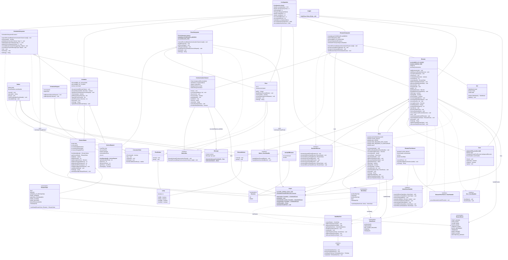

# Iteration 5 UML Class Diagram

```mermaid 
classDiagram

    class Floor {
        -int id
        -boolean terminated

        getID():integer
        handleButtonPressed(Button):void
        isTerminated():boolean
        receiveRequest(ServiceRequest):void
        terminate():void
        toString():String
    }

    class FloorButton {
        cancel():void
        press():void
    }

    class FloorSubsystem {
        +FloorSubsystem instance$
        -inetAddress SCHEDULER_ADDRESS$
        -int SCHEDULER_PORT$

        +channelReceivedData(CommunicationChannel, byte[]):void
        -handleRequests():void
        -initFloors(Integer):void
        -initRequests(String):void
        +sendRequestToScheduler(ServiceRequest):void
        -terminate():void
        +toString():String
    }

    class Async {
        -int CORE_THREAD_POOL_SIZE$
        -ScheduledThreadPoolExecutor executor$
        +later(double, Runnable)$:ScheduledFuture<?>
        -ms(double)$:long
        +repeat(double, double, Runnable)$:ScheduledFuture<?>
        +repeat(double, Runnable)$:ScheduledFuture<?>
        +run(Runnable)$:Future<?>
        +terminateThreadPool()$:void
    }

    class Button {
        #String label 
        #EventHandler eventHandler
        +cancel()*:void
        +getLabel():String
        +press()*:void
        +setEventHandler(EventHandler):void
        +setLabel(String):void
    }

    class Button_EventHandler {
        <<interface>>
        +handleButtonPressed(Button):void
        +handleButtonCancelled(Button):void
    }

    class CommunicationChannel {
        -Future<?> backgroundReceivingTask
        -InetAddress recipientAddress
        -Integer recipientPort
        -DatagramSocket socket
        -Subscriber[] subscribers

        +close():void
        +connect(InetAddress, int):void 
        +disconnect():void
        +isConnected():boolean
        +publish(byte[]):void
        +publish(T):void
        -receive():byte[]
        -receive(int):byte[]
        +subscriber(Subscriber):void
        +unsubscribe(Subscriber):boolean
    }

    class Subscriber {
        <<interface>>
        ChannelIsclosed(CommunicationChannel):void
        ChannelReceivedData(CommunicationChannel, byte[]):void
    }

    class ConcurrentTask {
        isTerminated()*:boolean
        run():void
        run(double):void
        terminate():void
        timeIntervalBetweenRuns():double
    }

    class Configuration {
        +Configuration shared$
        +double accerlationRate = 0.32
        +double doorOpenCloseTime = 2
        +int floorHeight = 4
        +String floorRequestsFilePath
        +double loadingTime = 8
        +double maxSpeed = 1.6
        +int numberOfElevators = 4
        +int numberOfFloors = 22
        +InetAddress schedulerAddress
        +int schedulerPortForElevators = 3303
        +int schedulerPortForFloors = 3304
    }

    class Direction {
        <<enumeration>>
        UP
        DOWN
    }

    class Lamp {
        -boolean on 
        +isOff():boolean
        +isOn():boolean
        +turnOff():boolean
        +turnOn():boolean
    }

    class Logger {
        +log(String, String, String)$:void
    }

    class ServiceRequest {
        +fromBytes(byte[])$:ServiceRequest
        -LocalTime time 
        -int sourceFloor 
        -boolean goingUp
        -int destinationFloor
        -int error
        +getDestinationFloor():int
        +getError():int
        +getSourceFloor():int
        +getTime():LocalTime
        +isGoingUp():boolean
    }

    class StateMachine {
        +currentState():SomeState
        +didEnterState(SomeState):void
        +didLeaveState(SomeState):void
        +getStateMachine():SomeStateMachine
        +handleEvent(SomeEvent):void
        +run(double):void
        +switchState(SomeState, SomeEvent):void
        +willEnterState(SomeState):void
        +willLeaveState(SomeState):void
    }

    class State {
        <<interface>>
        +enter(TheStateMachine):void
        +leave(TheStateMachine):void
        +nextState(TheEvent,TheStateMachine):TheState
        +run(double, TheStateMachine):void
    }

    class Door {
        +double OPEN_CLOSE_TIME$
        -boolean open 
        -ScheduledThreadPoolExecutor backgroundExecutor
        -EventHandler eventHandler
        +close():void
        +isClosed():boolean
        +isOpen():boolean
        +open():void
    }

    class Door_EventHandler {
        <<interface>>
        +doorOpen():void 
        +doorClosed():void
    }

    class Elevator {
        +int NUMBER_OF_FLOORS$
        +double LOADING_TIME$
        -Integer id 
        -boolean[] destinations
        +addDestination(int):void 
        +addObserver(ElevatorObserver):void
        +cancelFloorButton(int):void
        +closeDoor():void
        +containsDestination(int):boolean
        +currentFloor():int
        +currentSpeed():ElevatorState
        +didEnterState(ElevatorState):void
        +didLeaveState(ElevatorState):void
        +doorclosed():void
        +doorOpened():void
        +getID():int
        +getStateMachine():Elevator
        +handleButtonPressed(Button):void
        +isMoving():boolean
        +isStopped():boolean
        +isTerminated():boolean
        +motorIsStopped(Motor):void
        +motorStartingToMove(Motor):void
        +move(Direction, int):void
        +movingDirection():Direction
        +nextDestination():Integer
        +numberOfDestinations():int
        +openDoor():void
        +pressFloorButton(int):void
        +removeDestination(int):void
        +removeObserver(ElevatorObserver):void
        +run():void
        +sensorDetectedArrivalOfFloor(int):void
        +switchState(ElevatorState, +ElevatorEvent):void
        +terminate():void
        +toString():String
        +willEnterState(ElevatorState):void
        +willLeaveState(ElevatorState):void
    }

    class ElevatorButton {
        +cancel():void
        +press():void
    }

    class ElevatorEvent {
        <<enumeration>>
        START_MOVING
        OPEN_DOOR
        CLOSE_DOOR
        BLOCK_DOOR
        UNBLOCK_DOOR
        BLOCK_MOVEMENT
        TERMINATE
        DOOR_OPENED
        DOOR_CLOSED
        DESTINATION_ARRIVED
    }

    class ElevatorFloorSensor {
        -double$ FLOOR_HEIGHT
        -EventHandler eventHandler
        -int floor
        -double floorOffset
        +currentFloor():int
        +motorMoved(Motor,Direction,double):void
        +toString():String
    }

    class ElevatorFloorSensor_EventHandler {
        <<interface>>
        sensorDetectedArrivalOfFloor(int)*:void
    }

    class ElevatorObserver {
        <<interface>>
        +elevatorArrivedAtFloor(Elevator,int):void
        +elevatorDidEnterState(Elevator, ElevatorState):void
        +elevatorDidLeaveState(Elevator, ElevatorState)
        +elevatorDoorIsClosed(Elevator):void
        +elevatorDoorIsOpened(Elevator):void
        +elevatorIsTerminated(Elevator):void
        +elevatorWillEnterState(Elevator, ElevatorState):void
        +elevatorWillLeaveState(Elevator, ElevatorState):void
    }

    class ElevatorState { 
        <<enumeration>>
        IDLE
        MOVING
        ARRIVED_AT_DESTINATION
        DOOR_OPENING
        AWAITING_PASSENGERS
        DOOR_CLOSING
        DOOR_BLOCKED
        ELEVATOR_BLOCKED
        TERMINATED
        +nextState(ElevatorEvent, Elevator):ElevatorState
    }

    class ElevatorStatus { 
        -Instant date
        -int elevatorID
        -int numberOfDestinations
        -int numberOfPassengers
        -int nearestStoppableFloor
        +fromBytes$(byte[]):ElevatorStatus
        +getCurrentState():ElevatorState
        +getDate():Instant
        +getElevatorID():int
        +getMovingDirection():Direction
        +getNearestStoppableFloor():int
        +getNumberOfDestinations():int
        +getNumberOfPassengers():int
        -readObject(ObjectInputStream):void
        -readObjectNoData():void
        +toString():String
        -writeObject(ObjectOutputStream):void
    }

    class ElevatorSubsystem {
        +InetAddress$ SCHEDULER_ADDRESS
        +int$ SCHEDULER_PORT
        +int$ NUMBER_OF_ELEVATORS
        +ElevatorSubsystem$ instance
        -ScheduledFuture<?>[] backgroundUpdates
        +channelReceivedData(CommunicationChannel, byte[]):void
        +elevatorArrivedAtFloor(Elevator, int):void
        +elevatorIsTerminated(Elevator):void
        -sendElevatorStatusToScheduler(Elevator):void
    }

    class Motor {
        -double$ ACCELERATION_RATE
        -double$ FLOOR_HEIGHT
        -double$ MAX_SPEED
        -double$ TIME_REQUIRED_PER_FLOOR
        -double$ TIME_REQUIRED_TO_DECELERATE
        -double$ speed 
        +accelerate(double):void
        +addEventHandler(MotorEventHandler):void
        +currentMovingDirection():Direction
        +currentSpeed():double
        +currentState():MotorState
        +decelerate(double):void
        +didEnterState(MotorState):void
        +didLeaveState(MotorState):void
        +getStateMachine():Motor
        +isMoving():boolean
        +isStopped():boolean
        +isTerminated():boolean
        +move(Direction, int):void
        +switchState(MotorState, MotorEvent):void
        +terminate():void
        +toString():String
        -updateSpeed(double):void
        +willEnterState(MotorState):void
        +willLeaveState(MotorState):void
    }

    class MotorEvent {
        <<enumeration>>
        ACCELERATE 
        DECELERATE
        MAX_SPEED_REACHED
        STOPPED
        TERMINATE
    }

    class MotorEventHandler {
        <<interface>>
        +motorDidEnterState(Motor, MotorState):void
        +motorDidLeaveState(Motor, MotorState):void
        +motorIsStopped(Motor):void
        +motorMoved(Motor, Direction, double):void
        +motorReachedMaxSpeed(Motor):void
        +motorStartingToMove(Motor):void
        +motorWillEnterState(Motor, MotorState):void
        +motorWillLeaveState(Motor, MotorState):void
    }

    class MotorState {
        <<enumeration>>
        ACCELERATING
        CRUISING
        DECELERATING
        IDLE
        TERMINATED
        +nextState(MotorEvent, Motor):MotorState
    }

    class ArrivalOfElevator {
        -int currentCycle
        -int floor
    }

    class Message {
        -Content content
        -Message.Type type
        +determineMessageType(byte[])$:Type
        +getContent(byte[])$:Object
    }

    class SchedulerRequest {
        -int elevatorID
        -Instant time
        +addRequest(ServiceRequest):void
        +addRequests(Collection<ServiceRequest>):void
    }

    class Scheduler {
        -int$ NUMBER_OF_ELEVATORS
        -int$ NUMBER_OF_FLOORS
        -boolean terminated
        +elevatorArrived(ElevatorStatus):void
        -elevatorDispatched(int, Direction):boolean
        +handleServiceRequest(ServiceRequest):void
        +isTerminated():boolean
        -pullRequestsFromFloor(int):Set<ServiceRequest>
        +requestsFromFloor(int):Set<ServiceRequest>
        -selectElevator(int, Direction):int
        +terminate():void
        +toString():String
        +updateElevator(ElevatorStatus):void
    }

    class SchedulerSubsystem {
        +SchedulerSubsystem$ instance
        +channelReceivedData(CommunicationChannel, byte[]):void
        +isTerminated():boolean
        -publish(CommunicationChannel, Type, T):void
        +publishToElevatorSubsystem(Type, T):void
        +publishToFloorSubsystem(Type, T):void
        -receivedElevatorSystemMessage(Type, Object):void
        -receivedFloorSystemMessage(Type, Object):void
        +run():void
        +terminate():void
        +toString():String
    }

    class GUI {
        -TableModel model 
        -JFrame frame
        -JTable table
        -initializeTableModel():TableModel
        +update():void
    }

    ElevatorSubsystem o-- GUI
    Configuration -- Door 
    Configuration -- Elevator
    Configuration -- ElevatorSubsystem
    Configuration -- Motor
    Configuration -- Floor
    Configuration -- FloorSubsystem
    Configuration -- Scheduler
    Configuration -- SchedulerSubsystem
    CommunicationChannel --> Async : run()
    Elevator --> Async : run()
    Motor --> Async : run()
    FloorSubsystem --> Async:run(), terminateThreadPool()
    SchedulerSubsystem --> Async: run(), terminateThreadPool()
    ElevatorSubsystem --> Async: run()
    CommunicationChannel --> Message : oos.writeObject(), publish()
    Motor --> MotorEvent : handleEvent()
    MotorState --> MotorEvent: nextState()
    ElevatorState --> ElevatorEvent : nextState()
    Elevator --> ElevatorEvent : handleEvent()
    SchedulerSubsystem o-- Scheduler
    SchedulerSubsystem o-- CommunicationChannel
    SchedulerSubsystem ..|> ConcurrentTask
    SchedulerSubsystem ..|> Subscriber
    Scheduler o-- ServiceRequest
    Scheduler o-- ElevatorStatus
    Scheduler ..|> ConcurrentTask
    SchedulerRequest o-- ServiceRequest
    ArrivalOfElevator o-- Direction
    MotorState ..|> StateMachine
    Motor ..|> StateMachine
    Motor o-- Direction 
    Motor o-- MotorState
    ElevatorSubsystem o-- Elevator
    ElevatorSubsystem o-- CommunicationChannel
    ElevatorSubsystem ..|> Subscriber
    ElevatorSubsystem ..|> ElevatorObserver
    ElevatorStatus o-- ElevatorState
    ElevatorStatus o-- Direction
    ElevatorState ..|> StateMachine
    ElevatorFloorSensor -- ElevatorFloorSensor_EventHandler
    ElevatorFloorSensor ..|> MotorEventHandler
    ElevatorButton o-- Lamp
    Button <|-- ElevatorButton
    Button -- Button_EventHandler
    CommunicationChannel -- Subscriber
    StateMachine -- State
    Floor o-- FloorButton
    Floor ..|> ConcurrentTask
    Floor ..|> Button_EventHandler
    Button <|-- FloorButton
    FloorButton o-- Lamp
    FloorSubsystem ..|> Subscriber
    FloorSubsystem o-- CommunicationChannel
    FloorSubsystem o-- Floor
    FloorSubsystem o-- ServiceRequest
    Door .. Door_EventHandler
    Elevator ..|> Button_EventHandler
    Elevator ..|> Door_EventHandler
    Elevator ..|> ElevatorFloorSensor_EventHandler
    Elevator ..|> MotorEventHandler
    Elevator ..|> StateMachine
    Elevator o-- Door
    Elevator o-- Motor
    Elevator o-- ElevatorFloorSensor
    Elevator o-- ElevatorButton
    Elevator o-- ElevatorObserver
```
